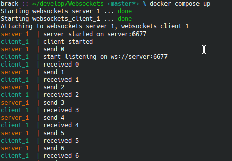

# Websockets Example
This project implements a simple implementation of a client/server based on websockets in Python, where the client and the server are in separate docker containers

This example shows
* how a websocket-based communication works
* how a communication between docker containers is to be setup

## Client/Server in action

## Prerequisites
* [Install docker](https://docs.docker.com/get-docker/)
* Install docker-compose

## Run
Start both server and client container in one command

    docker-compose up --build

## Building blocks
### Python
In the client and server directory, you perform

	python3 -m venv venv  
	source venv/bin/activate  
	pip install websockets
	pip freeze > requirements.txt  
		
### Docker
Create a `Dockerfile` in the client and server folders

### Docker Compose
Create a `docker-compose.yml`
Both containers share the same network `test-websockets`, therefore you don't need to publish the port 6677 to the host 
	
	services:  
		server:  
			build: server  
			networks:  
			- test-websockets  
		  
		client:  
			build: client  
			networks:  
			- test-websockets  
			depends_on:  
			- server  
		  
		networks:  
			test-websockets:

